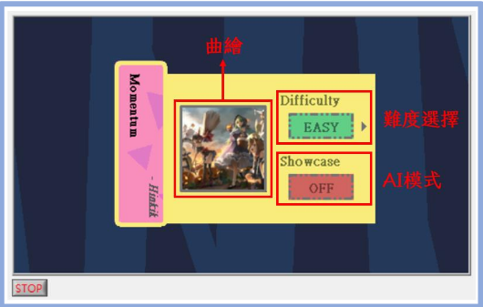

# LabVIEW Final Project
*Team Project (2 people)*
## Intro
The final project needed to used LabVIEW to design a game. We chose to make rhythm game that is similar to [*Muse Dash*](https://en.wikipedia.org/wiki/Muse_Dash). This includes making gameplay design, level file formats, visuals, autoplay, etc..  
In the end, we made 2 games with 2 difficulties, with result display system.

>**Files**  
[**Report**](https://github.com/Mars-1114/cs-portfolio/blob/main/2023%20Autumn%20-%20LabVIEW%20(game)/LabVIEW期末專案%20-%20簡易音樂遊戲.pdf)  
[**Code**](https://github.com/Mars-1114/cs-portfolio/tree/main/2023%20Autumn%20-%20LabVIEW%20(game)/Rhythm%20Game)  
[**Gameplay Showcase**](https://www.youtube.com/watch?v=YGYGrdy6cf8)

## Game

  
**The game menu**

  
**The selection menu**

  
**The gameplay**

  
**The result screen**

## Features
- Designed a custom file format to store the level data
- Using **masking** and **easing function** to achieve a better-looking interface

## What I Learned
- How to use **LabVIEW**
- Game design procedure

## Improvements
- Adding more features such as pausing, volume adjustment, more elements can enhance the player experience.
- A multiplayer mode that makes several players compete with each other can be considered.

## Contributions
| Member    | Game Design | Level Design | Report |
| ------    | ----------- | ------------ | ------ |
| **嚴偉哲** | 100%        | 70%          | 95%    |  
| **黃琮仁** | 0%          | 30%          | 5%     |