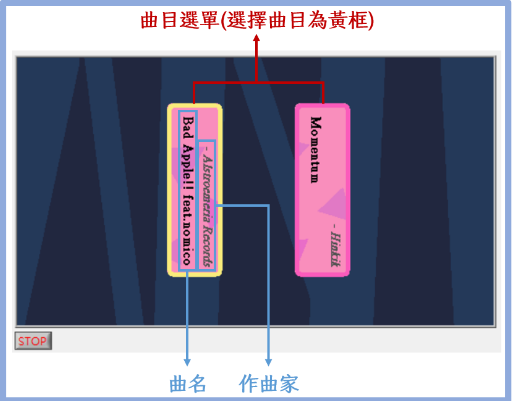

# LabVIEW Final Project
*Team Project (2 people)*
## Intro
The final project needed to used LabVIEW to design a game. We chose to make rhythm game that is similar to *Muse Dash*. This includes making gameplay design, level file formats, visuals, autoplay, etc..  
In the end, we made 2 games with 2 difficulties, with result display system.

## Game
  
**The game menu**

  
**The selection menu**

  
**The gameplay**

  
**The result screen**

## What I Learned
- How to use **LabVIEW**
- Game design procedure

## Improvements
- T

## Contributions
| Member    | Game Design | Level Design | Report |
| ------    | ----------- | ------------ | ------ |
| **嚴偉哲** | 100%        | 70%          | 90%    |  
| **黃琮仁** | 0%          | 30%          | 10%    |