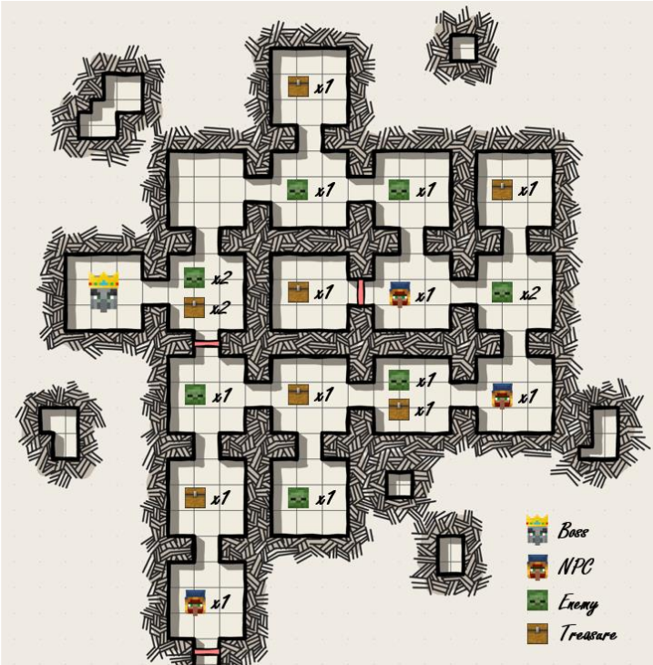
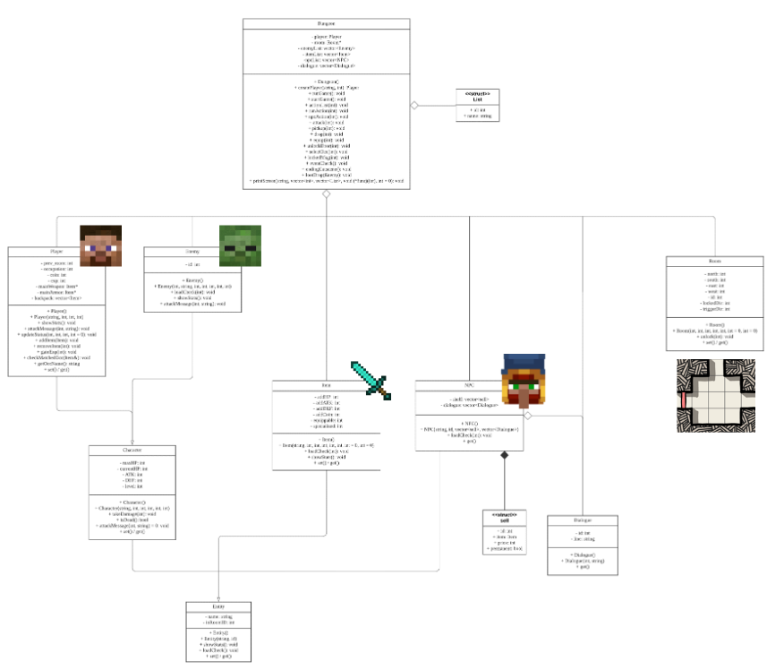
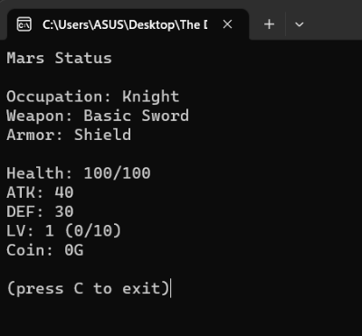
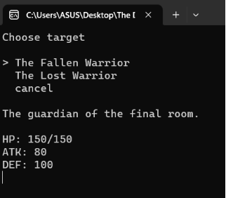

# OOP Final Project
*Solo Project*
## Intro
We needed to make a cmd-based RPG game with OOP usage requirement such as inheritance and virtual function. I made a game with multiple classes, dialogues, and multi-ending.  
This is a great opportunity for me to practice OOP and the first time of me making a medium-sized project. I put a lot of efforts and time to implement my ideas and I think I learned a lot about game design and OOP and I'm pretty satisfied with the outcome.

## Game
  
**Dungeon Layout**

  
**UML**

  
**Player Statistics**

  
**Combat System**

## What I Learned
- OOP basics
- Game design procedure

## Improvements
- Expand the dungeon layout and categorize the items in the backpack to make the game look nicer