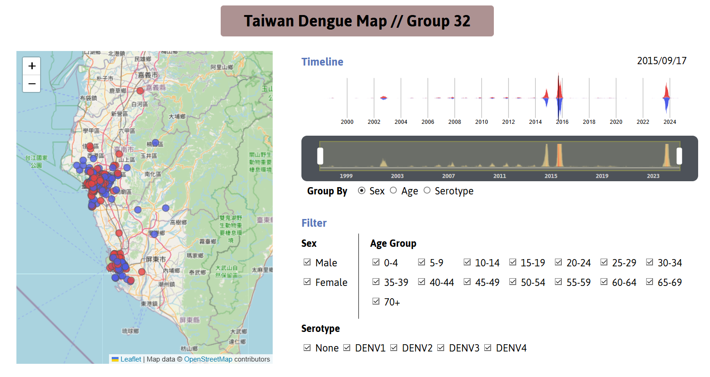

# Data Visualization Final Project
*Team Project (2 people)*
## Intro
We were tasked to make a webpage that visualizes the dataset we used, with interactive graphs and multiple representations of data. We chose the Dengue cases in Taiwan for 27 years and observe the regions and the size of the outbreaks over time.

>**Dataset:**  
[Taiwan Dengue Cases 1998-2024](https://www.kaggle.com/datasets/taweilo/taiwan-dengue-daily-confirmed-cases-1998-2024)  

>**Files**  
[**Proposal**](https://github.com/Mars-1114/cs-portfolio/blob/main/2024%20Autumn%20-%20Data%20Visualization%20Final%20Project%20(website)/Final%20Project%20Proposal_Group%2032.pdf)  
[**Report**](https://github.com/Mars-1114/cs-portfolio/blob/main/2024%20Autumn%20-%20Data%20Visualization%20Final%20Project%20(website)/report.pdf)  
[**Codes**](https://github.com/Mars-1114/cs-portfolio/tree/main/2024%20Autumn%20-%20Data%20Visualization%20Final%20Project%20(website)/Dengue%20Map)

## Goal
- Observe the spread and time period of the disease
- See the composition of the cases in age groups, sexes, and serotypes.

## Result
- We mainly used three types of graph to visualize the dataset, namely **horizon chart** (number of cases), **streamgraph** (number of each categories), and **dot map** (distribution of cases).
- The outbreak happens periodically every year, starts from September and ends from December.
- The diseases mostly occur in urban areas like Kaohsiung, Tainan, and Taipei  
 

***Website Screenshot***

## What I Learned
- Ways of visualize a large set of data, like **horizon chart** and **streamgraph** that are used in this project.
- How to include interaction to enhance the chart.
- The use of **D3 library** in JavaScript.

## Improvements
- The graph could be better if it shows the movements of the diagnosed people, which is including in the dataset we used. This way, we can better understand how the disease is spread across the region.

## Contributions
| Member    | Website | Report |
| ------    | ------- | -----  |
| **嚴偉哲** | 95%     | 0%     |
| **郭穎達** | 5%      | 100%   |