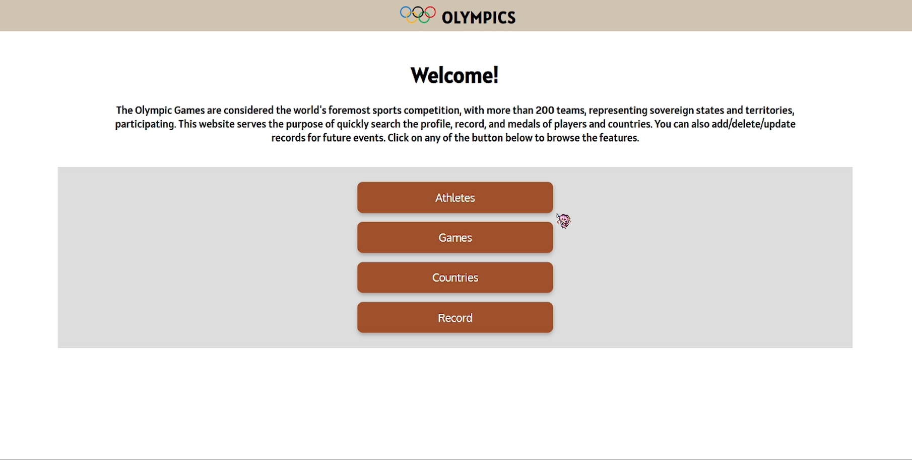
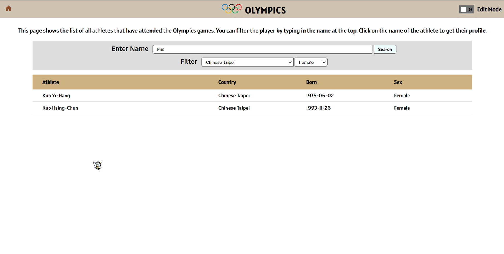
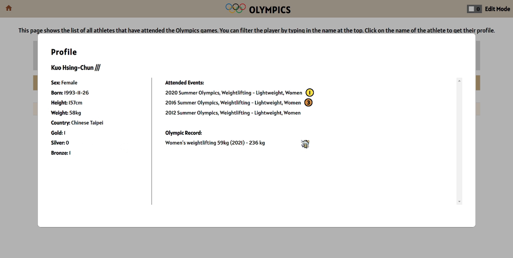
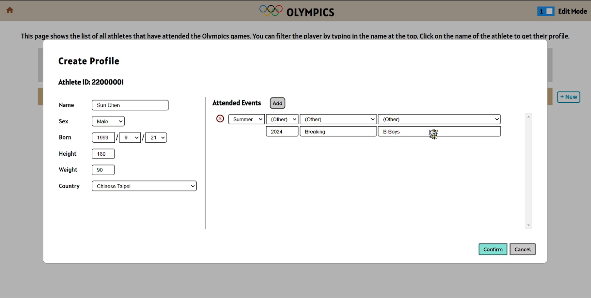
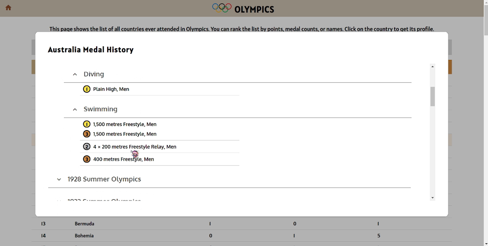

# Database Final Project
*Team Project (5 people)*
## Intro
We built a website that can look up the information about every Olympic event. To build a database, MySQL is used in this project.  
This website offers features like searching athletes, inserting/deleting records, browse individual events, and more!

>**Dataset:**  
[126 Years of Historical Olympic](https://www.kaggle.com/datasets/muhammadehsan02/126-years-of-historical-olympic-dataset)  

>**Files**  
[**Report**](https://github.com/Mars-1114/cs-portfolio/blob/main/2024%20Autumn%20-%20Database%20Final%20Project%20(website)/Project_Team22.pdf)  
[**Codes**](https://github.com/Mars-1114/cs-portfolio/tree/main/2024%20Autumn%20-%20Database%20Final%20Project%20(website)/code)  
[**Showcase**](https://www.youtube.com/watch?v=0wX515MbXHY)

## Goal
- Build a website with a database
- Implement **CRUD** functionalities

## Screenshots

***Main Menu***

***Browse Athletes***

***Athlete Profile***

***Create Athlete***

***Country Profile***

## What I Learned
- The basics of database system and how to use it (MySQL)
- SQL and PHP language
- How to connect frontend to backend
- Team communication and cooperation

## Improvements
- Adding account system can let users to test the updated database without modifying the real data.
- Implement SQL injection to prevent malicious attack on the database.

## Contributions
| Member    | Frontend | Backend | SQL    | Report |
| ------    | ------   | ------  | ------ | ------ |
| **嚴偉哲** | 70%      | 60%     | 0%     | 5%     |
| **劉真宏** | 0%       | 0%      | 10%    | 50%    |
| **林啟堯** | 30%      | 40%     | 0%     | 15%    |
| **彭叡楀** | 0%       | 0%      | 45%    | 15%    |
| **駱巍文** | 0%       | 0%      | 45%    | 15%    |