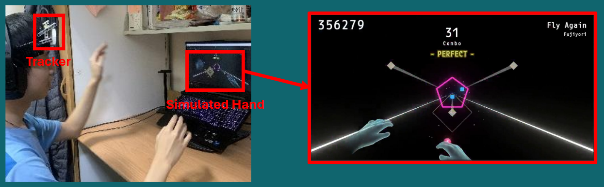
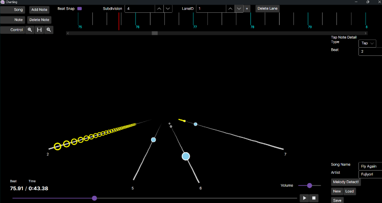
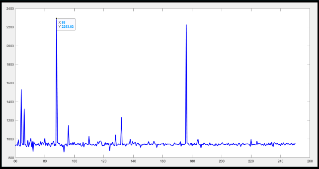
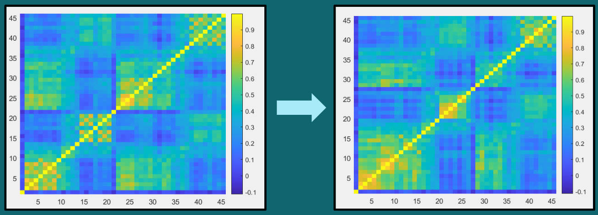

# CS Project
*Solo Project*
## Intro
In this 1-year project, I made a **rhythm game** that is played with a **hand tracker** and its editor with an assist tool that can **detect song BPM and melody**.  

1. For the game, a 3D fixed position gameplay is chosen, with **LeapMotion Controller 2** to detect the hands' movement.  
2. An editor app is then created to help player design their levels. This is written in the **Avalonia Framework**.  
3. Two assist tools are integrated into the editor, including **tempo estimation** and **main melody detection**.

>**Files**  
[**Work Logs**](./work%20log/)  
[**Editor Guide**](./editor/Chart%20Editor%20Guide.pdf)  
[**Reports**](./report/)  
==================================  
[**Game Source Code**](./game/Assets/)  
[**Editor Source Code**](./editor/Charting/)  
[**Assist Tools Source Code**](./assist%20tools/BPM%20&%20Melody%20Detection/)  
==================================  
[**Game Showcase**](https://youtu.be/-yDy5Ne4b7w)  
[**Editor Showcase**](https://www.youtube.com/watch?v=e957_KoDARU)

## Goal
- Make a functional and complete game.
- Design a GUI editor to create levels in ease.
- Research and implement ways of BPM and melody detection methods.

## Results
Here will mainly discuss the results of assist tools implementation.
- Using "percussioness" as the preprocess method generally outperforms than others (energy, weighted energy) in tempo detection. 
- The code can estimate the BPM accurately most of the time when detecting EDMs, but for non electronic musics it shows a worse accuracy.
- Melody detection underperforms with many false positives occuring when testing it with complex musics.

## Screenshots
  
***Gameplay***  
 

  
***Editor***
 

  
***Tempo Estimation Result***
 

  
***Melody Block Clustering in Main Melody Detecton*** (left: sequential, right: correlation)

## What I Learned
- Game design process
- Basic human-computer interaction implementation (LeapMotion)
- Music signal processing
- Software development (Avalonia)
- Usage of many programs (Unity, Blender, MatLab, etc.)

## Improvements
- Using Evaluation metrics to the detection method can make the result more convincing.
- The game can be extended to VR to enhance the playing experience.
- Find a way to replace the hand tracker to reduce the playing cost.
- Use machine learning models to improve the program's ability to detect main melody.